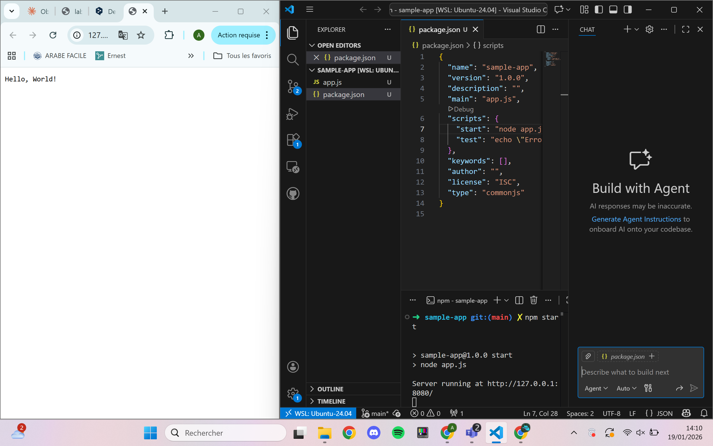
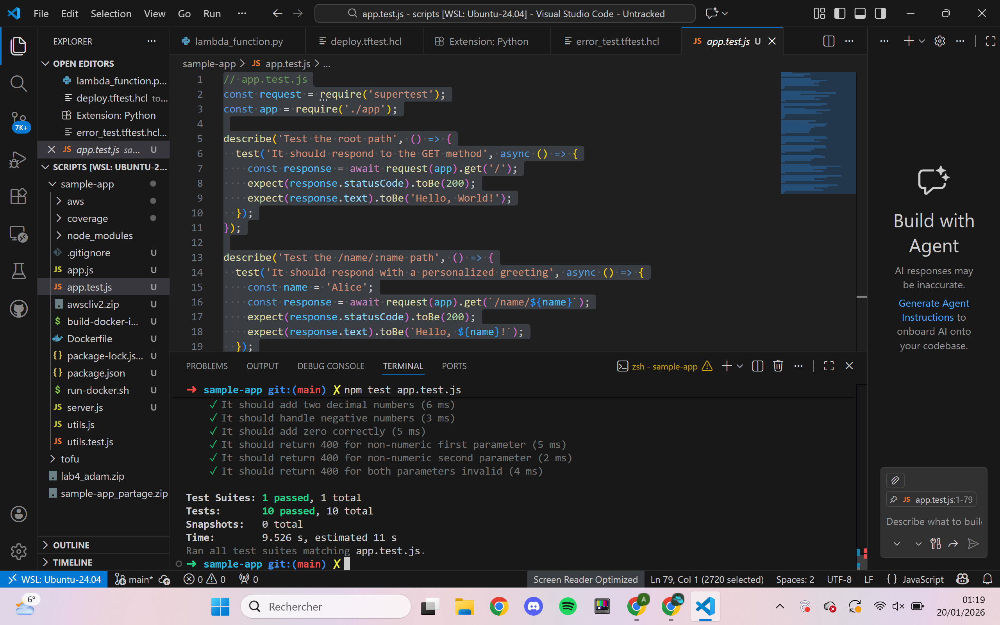
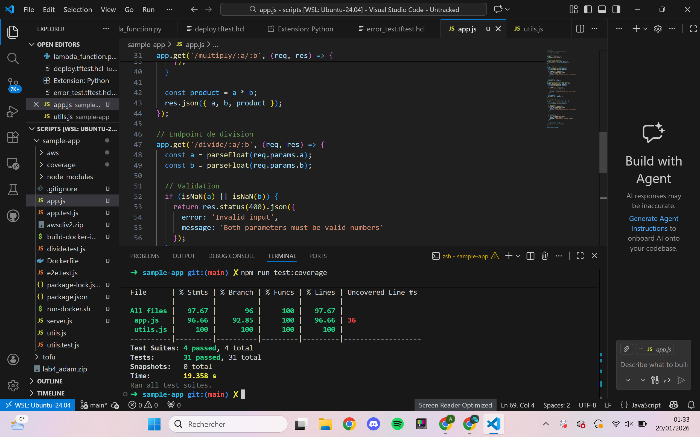
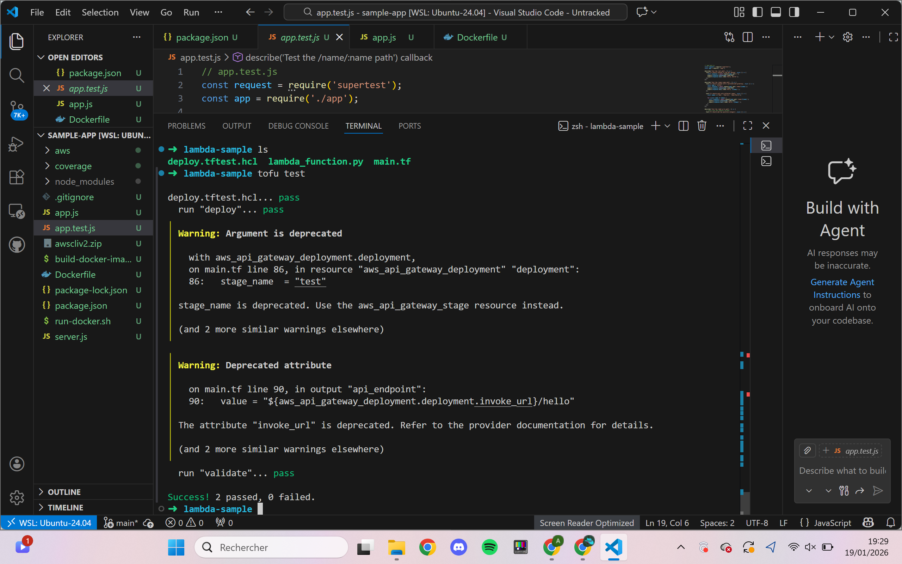

---

## Objectifs

Ce lab explore les systèmes de build, les tests automatisés et le déploiement d'une fonction AWS Lambda testée via OpenTofu. Il couvre trois niveaux de tests : unitaires, d'intégration et end-to-end, ainsi que l'approche TDD (Test-Driven Development).

---

## Partie 1 : Application Node.js avec Tests Automatisés

### Structure de l'application

L'application est une API Express exposant des opérations mathématiques avec validation des entrées.

**Routes implémentées :**
```javascript
app.get('/', ...)               // Hello World
app.get('/name/:name', ...)     // Salutation personnalisée
app.get('/add/:a/:b', ...)      // Addition
app.get('/multiply/:a/:b', ...) // Multiplication
app.get('/divide/:a/:b', ...)   // Division avec gestion division par zéro
```

**Gestion des erreurs dans chaque endpoint :**
```javascript
app.get('/divide/:a/:b', (req, res) => {
  const a = parseFloat(req.params.a);
  const b = parseFloat(req.params.b);

  if (isNaN(a) || isNaN(b)) {
    return res.status(400).json({
      error: 'Invalid input',
      message: 'Both parameters must be valid numbers'
    });
  }

  if (b === 0) {
    return res.status(400).json({
      error: 'Invalid input',
      message: 'Cannot perform division by zero'
    });
  }

  res.json({ a, b, quotient: a / b });
});
```



---

## Partie 2 : Fonctions Utilitaires (utils.js)

Séparation de la logique métier dans un module dédié pour faciliter les tests unitaires :
```javascript
function isValidNumber(str) {
  if (str === '' || str === null || str === undefined) return false;
  const num = parseFloat(str);
  if (isNaN(num) || !isFinite(num)) return false;
  // parseFloat('5a') retourne 5, on vérifie que toute la chaîne est convertie
  if (String(num) !== String(str).trim()) return false;
  return true;
}

function add(a, b) { return a + b; }
function multiply(a, b) { return a * b; }
```

---

## Partie 3 : Tests Automatisés avec Jest et Supertest

### Configuration (package.json)
```json
{
  "scripts": {
    "test": "jest --verbose",
    "test:coverage": "jest --coverage --verbose"
  },
  "devDependencies": {
    "jest": "^30.2.0",
    "supertest": "^7.2.2"
  }
}
```

### Tests Unitaires (utils.test.js)

Tests des fonctions utilitaires de manière isolée, sans démarrer le serveur :
```javascript
describe('isValidNumber', () => {
  test('should return true for valid integers', () => {
    expect(isValidNumber('5')).toBe(true);
    expect(isValidNumber('-10')).toBe(true);
  });

  test('should return false for invalid strings', () => {
    expect(isValidNumber('abc')).toBe(false);
    expect(isValidNumber('5a')).toBe(false);
    expect(isValidNumber('')).toBe(false);
  });

  test('should return false for special values', () => {
    expect(isValidNumber('Infinity')).toBe(false);
    expect(isValidNumber('NaN')).toBe(false);
  });
});
```

### Tests d'Intégration (app.test.js)

Tests des endpoints HTTP avec Supertest, vérifiant la chaîne complète route → logique → réponse :
```javascript
describe('Test the /add/:a/:b path', () => {
  test('It should add two positive integers', async () => {
    const response = await request(app).get('/add/5/3');
    expect(response.statusCode).toBe(200);
    expect(response.body.sum).toBe(8);
  });

  test('It should add two decimal numbers', async () => {
    const response = await request(app).get('/add/2.5/3.7');
    expect(response.statusCode).toBe(200);
    expect(response.body.sum).toBeCloseTo(6.2, 1);
  });

  test('It should return 400 for non-numeric input', async () => {
    const response = await request(app).get('/add/abc/5');
    expect(response.statusCode).toBe(400);
    expect(response.body.error).toBe('Invalid input');
  });
});
```



---

## Partie 4 : TDD - Test Driven Development (divide.test.js)

L'endpoint `/divide` a été développé selon l'approche TDD : les tests sont écrits **avant** le code. On écrit d'abord les tests qui échouent, puis on implémente le code pour les faire passer.
```javascript
describe('TDD - Division endpoint', () => {
  test('It should divide two positive integers', async () => {
    const response = await request(app).get('/divide/10/2');
    expect(response.statusCode).toBe(200);
    expect(response.body.quotient).toBe(5);
  });

  test('It should divide decimal numbers', async () => {
    const response = await request(app).get('/divide/10/4');
    expect(response.statusCode).toBe(200);
    expect(response.body.quotient).toBeCloseTo(2.5, 1);
  });

  test('It should return 400 for division by zero', async () => {
    const response = await request(app).get('/divide/10/0');
    expect(response.statusCode).toBe(400);
    expect(response.body.message).toContain('division by zero');
  });

  test('It should return 400 for invalid input', async () => {
    const response = await request(app).get('/divide/abc/5');
    expect(response.statusCode).toBe(400);
    expect(response.body.error).toBe('Invalid input');
  });
});
```

### Tests End-to-End (e2e.test.js)

Simulation de scénarios utilisateurs complets enchaînant plusieurs appels API :
```javascript
test('Complete calculation workflow', async () => {
  // 1. Addition
  const addResult = await request(app).get('/add/10/5');
  expect(addResult.body.sum).toBe(15);

  // 2. Multiplication avec le résultat précédent
  const multiplyResult = await request(app)
    .get(`/multiply/${addResult.body.sum}/2`);
  expect(multiplyResult.body.product).toBe(30);

  // 3. Vérifier endpoint racine
  const rootResult = await request(app).get('/');
  expect(rootResult.statusCode).toBe(200);
});
```



---

## Partie 5 : Déploiement AWS Lambda avec OpenTofu

### Fonction Lambda Python
```python
def lambda_handler(event, context):
    return {
        'statusCode': 200,
        'headers': {'Content-Type': 'application/json'},
        'body': json.dumps({
            'message': 'Hello from Lambda!',
            'status': 'success',
            'version': '2.0'
        })
    }
```

### Infrastructure OpenTofu (main.tf)

Déploiement de la Lambda avec API Gateway :
```hcl
resource "aws_lambda_function" "sample" {
  filename      = data.archive_file.lambda_zip.output_path
  function_name = "sample_hello_world"
  role          = aws_iam_role.lambda_role.arn
  handler       = "lambda_function.lambda_handler"
  runtime       = "python3.12"
}

resource "aws_api_gateway_deployment" "deployment" {
  depends_on  = [aws_api_gateway_integration.lambda]
  rest_api_id = aws_api_gateway_rest_api.api.id
  stage_name  = "test"
}

output "api_endpoint" {
  value = "${aws_api_gateway_deployment.deployment.invoke_url}/hello"
}
```

### Tests OpenTofu (deploy.tftest.hcl)

OpenTofu permet de tester l'infrastructure déployée avec des assertions :
```hcl
run "validate" {
  command = apply

  assert {
    condition     = data.http.test_endpoint.status_code == 200
    error_message = "Expected status 200"
  }

  assert {
    condition = jsondecode(data.http.test_endpoint.response_body).message == "Hello from Lambda!"
    error_message = "Unexpected message in JSON response"
  }

  assert {
    condition     = jsondecode(data.http.test_endpoint.response_body).version == "2.0"
    error_message = "Expected version 2.0"
  }
}
```



---

## Récapitulatif des types de tests

| Type | Fichier | Outil | Ce qu'il teste |
|------|---------|-------|----------------|
| Unitaire | `utils.test.js` | Jest | Fonctions isolées |
| Intégration | `app.test.js` | Jest + Supertest | Endpoints HTTP |
| TDD | `divide.test.js` | Jest + Supertest | Endpoint écrit après les tests |
| E2E | `e2e.test.js` | Jest + Supertest | Scénarios utilisateurs complets |
| Infrastructure | `deploy.tftest.hcl` | OpenTofu test | API Lambda déployée sur AWS |